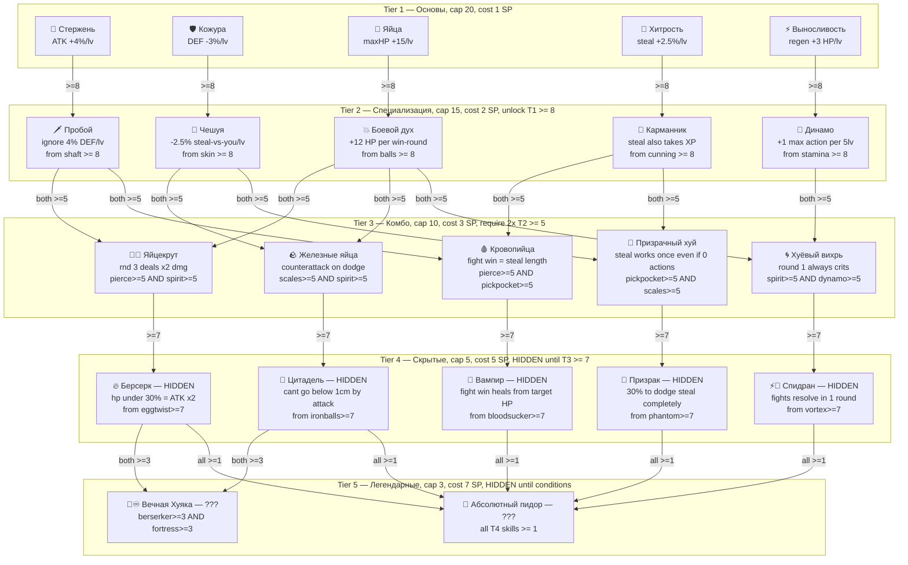

# Huya: Пятиуровневое дерево навыков

## Снятие лимита действий (временно)

В `[src/db/huya.rs](src/db/huya.rs)` изменить `DAILY_ACTIONS = 4` на `DAILY_ACTIONS = 20`. Позже вернём и подстроим под Tier 5 скилл `skill_dynamo`.

## Полная карта дерева (20 навыков)




## Детальные эффекты всех навыков

### Tier 1 (cap 20, cost 1 SP/level)


| ID              | Имя            | Эффект                                  |
| --------------- | -------------- | --------------------------------------- |
| `skill_shaft`   | 🍆 Стержень    | +4% урона за уровень                    |
| `skill_skin`    | 🛡 Кожура      | -3% входящего урона за уровень          |
| `skill_balls`   | 🥚 Яйца        | +15 max HP за уровень                   |
| `skill_cunning` | 🤌 Хитрость    | +2.5% к базовому шансу кражи за уровень |
| `skill_stamina` | ⚡ Выносливость | +3 HP регена за действие за уровень     |


### Tier 2 (cap 15, cost 2 SP/level)


| ID                 | Имя           | Эффект                                     | Prereq       |
| ------------------ | ------------- | ------------------------------------------ | ------------ |
| `skill_pierce`     | 🗡 Пробой     | Игнорировать 4% DEF врага за уровень       | shaft >= 8   |
| `skill_scales`     | 🐍 Чешуя      | -2.5% шанс украсть у тебя за уровень       | skin >= 8    |
| `skill_spirit`     | 💥 Боевой дух | +12 HP при победе в раунде                 | balls >= 8   |
| `skill_pickpocket` | 🥷 Карманник  | Кража также забирает 3% XP цели за уровень | cunning >= 8 |
| `skill_dynamo`     | 🔋 Динамо     | +1 макс. действие каждые 5 уровней         | stamina >= 8 |


### Tier 3 (cap 10, cost 3 SP/level — VISIBLE но заблокированы)


| ID                  | Имя               | Эффект                                      | Prereq                          |
| ------------------- | ----------------- | ------------------------------------------- | ------------------------------- |
| `skill_eggtwist`    | 🥚💥 Яйцекрут     | Каждый 3-й раунд наносит x2 урон            | pierce >= 5 AND spirit >= 5     |
| `skill_bloodsucker` | 🩸 Кровопийца     | Победа в раунде = кража 1mm × уровень       | pierce >= 5 AND pickpocket >= 5 |
| `skill_ironballs`   | 🪨 Железные яйца  | При уклонении от кражи — ответный удар -5mm | scales >= 5 AND spirit >= 5     |
| `skill_vortex`      | 🌀 Хуёвый вихрь   | Раунд 1 всегда критический (x1.5 урон)      | spirit >= 5 AND dynamo >= 5     |
| `skill_phantom`     | 👻 Призрачный хуй | 1 кража в сутки даже при 0 действий         | pickpocket >= 5 AND scales >= 5 |


### Tier 4 (cap 5, cost 5 SP/level — ПОЛНОСТЬЮ СКРЫТЫ до разблокировки T3 >= 7)

Отображаются как `🔮 ???` пока T3-prereq не достигнут. После разблокировки — анонс в чат.


| ID                | Имя         | Эффект                                                        | Prereq           |
| ----------------- | ----------- | ------------------------------------------------------------- | ---------------- |
| `skill_berserker` | 🔥 Берсерк  | При HP < 30% — ATK удваивается                                | eggtwist >= 7    |
| `skill_vampire`   | 🧛 Вампир   | Победа в бою восстанавливает HP пропорционально потерям врага | bloodsucker >= 7 |
| `skill_fortress`  | 🏰 Цитадель | Нельзя быть урезанным ниже 1 см атаками                       | ironballs >= 7   |
| `skill_speedrun`  | ⚡💨 Спидран | Все бои решаются за 1 раунд (без мини-игры)                   | vortex >= 7      |
| `skill_ghost`     | 🫥 Призрак  | 30% шанс полностью уклониться от кражи (не зависит от Чешуи)  | phantom >= 7     |


### Tier 5 (cap 3, cost 7 SP/level — АБСОЛЮТНО СКРЫТЫ, отображаются как `⬛⬛⬛`)

Имя видно только после первого level-up этого навыка. Unlock-сообщение отправляется в чат.


| ID               | Имя                 | Эффект                                                              | Prereq                           |
| ---------------- | ------------------- | ------------------------------------------------------------------- | -------------------------------- |
| `skill_eternal`  | 🍆♾️ Вечная Хуяка   | +15% ATK, DEF, HP, steal, regen за каждый уровень                   | berserker >= 3 AND fortress >= 3 |
| `skill_absolute` | 💫 Абсолютный Пидор | Все T4-скиллы на max: +25% ко всему + уникальный титул в `/huyatop` | все T4 >= 1                      |


## Формулы боя с новыми скиллами

```
ATK (per round):
  base = winner.length_mm * 0.05 + rand(10..25)
  pierce_factor = 1.0 / (1.0 - winner.skill_pierce * 0.04).max(0.1)  // пробивает DEF
  berserker_mult = if winner.hp < winner.max_hp()*0.3 && winner.skill_berserker > 0 { 2.0 } else { 1.0 }
  eternal_mult = 1.0 + winner.skill_eternal * 0.15
  vortex_crit = if round == 1 && winner.skill_vortex > 0 { 1.5 } else { 1.0 }
  eggtwist_crit = if round % 3 == 0 && winner.skill_eggtwist > 0 { 2.0 } else { 1.0 }
  atk_factor = (1.0 + winner.skill_shaft * 0.04) * berserker_mult * eternal_mult * vortex_crit * eggtwist_crit
  def_factor = max(0.15, 1.0 - loser.skill_skin * 0.03) * pierce_factor

  damage = max(5, (base * atk_factor * def_factor) as i32)

After round win:
  if winner.skill_spirit > 0: winner.ch_hp += spirit * 12
  if winner.skill_bloodsucker > 0: steal length_mm += bloodsucker * 1
  if winner.skill_vampire > 0: winner heals proportional to damage

Steal:
  chance = base_parity_chance + cunning * 0.025 + slick * 0.04 - target.scales * 0.025 + eternal * 0.15
  if target.skill_ghost active: 30% flat dodge
  if target.skill_ironballs > 0 AND steal missed: target steals -5mm from attacker
  if attacker.skill_phantom active: bypass 0-action limit (1x/day)

Fight end:
  if loser goes below 1cm AND loser.skill_fortress > 0: clamp to 10mm
  if winner.skill_speedrun > 0: resolve fight in round 1 immediately (pick keyboard skipped)
```

## Прогрессия SP

Все навыки суммарно требуют максимум:

- T1: 20 × 5 = 100 SP
- T2: 15 × 5 = 75 SP
- T3: 10 × 5 = 50 SP × cost 3 = 150 SP
- T4: 5 × 5 = 25 SP × cost 5 = 125 SP
- T5: 3 × 2 = 6 SP × cost 7 = 42 SP

**Итого**: ~600+ SP для полной прокачки. При 1 SP/уровень-хуяки → нужно 600+ уровней. Каждый уровень ≈ 100 XP. Это буквально сотни часов игры.

## UX `/huyaskills` (финальный вид)

```
🧬 Навыки @antobyte  (Очков: 3)

━━ I: ОСНОВЫ ━━━━━━━━━━━━━━━━━━━
🍆 Стержень    12/20  ██████░░░░  +48% ATK
🛡 Кожура       8/20  ████░░░░░░  -24% урона
🥚 Яйца         3/20  █░░░░░░░░░  +45 maxHP
🤌 Хитрость     5/20  ██░░░░░░░░  +12.5% кражи
⚡ Выносливость 10/20  █████░░░░░  +30 HP/ход

━━ II: СПЕЦИАЛИЗАЦИЯ ━━━━━━━━━━
🗡 Пробой       4/15  ██░░░░░░░░  -16% вражеской DEF
🐍 Чешуя   🔒 Кожура 8 (сейчас: 8 ✓ — нажми +1 для открытия)
💥 Боев. дух 🔒 Яйца 8 (сейчас: 3)
🥷 Карманник    2/15  █░░░░░░░░░  крадёт XP цели
🔋 Динамо       3/15  █░░░░░░░░░  +0 доп. действий (след. при 5)

━━ III: КОМБО ━━━━━━━━━━━━━━━━━
🥚💥 Яйцекрут  🔒 Пробой 5 (4/5) + Боев.дух 5 (0/5)
🩸 Кровопийца  🔒 Пробой 5 (4/5) + Карманник 5 (2/5)
🪨 Железные яйца  🔒 Заблокировано
🌀 Хуёвый вихрь  🔒 Заблокировано
👻 Призрачный хуй  🔒 Заблокировано

━━ IV: ??? (заблокировано) ━━━━
🔮 ???  🔒 Тайна откроется позже...

━━ V: ??? ━━━━━━━━━━━━━━━━━━━━━
⬛⬛⬛
```

## Файлы к изменению

- `migrations/20260304000005_huya_skill_tree.sql` — 15 новых INT колонок + `fights_won`, `fights_lost` + поднять дефолт `DAILY_ACTIONS`
- `[src/db/models.rs](src/db/models.rs)` — 17 новых полей в `Huya`, `max_hp()`, `max_actions()`, `skill_unlocked(name)` helper
- `[src/db/huya.rs](src/db/huya.rs)` — `upgrade_skill()` полное переписывание с деревом prereq, все боевые функции с Tier 3/4/5 эффектами, `DAILY_ACTIONS = 20`
- `[src/handlers/huya.rs](src/handlers/huya.rs)` — полный рефактор `skills_text()` + `skills_keyboard()` с 5 секциями, скрытие T4/T5 навыков, unlock-анонс
- `[locale/ru.toml](locale/ru.toml)` — 20 навыков с описаниями, 20 unlock-сообщений, обновить `skills_header`

